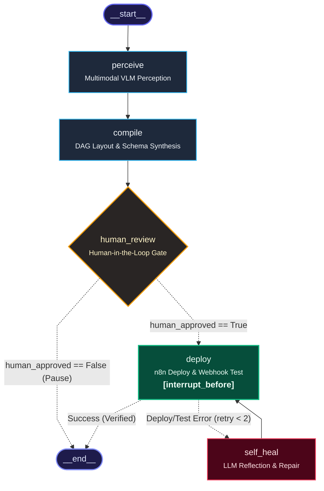

# SketchFlow

> **Autonomous Sketch-to-n8n Workflow Automation Platform**  
> Transform hand-drawn whiteboard flowcharts and paper sketches into structured, deployable n8n workflows.

[](https://opensource.org/licenses/MIT)
[](pyproject.toml)
[](uv.lock)
[](src/sketchflow/main.py)
[](src/sketchflow/agent/graph.py)
[](src/sketchflow/ui)
[](https://n8n.io)
[](tests/)

---

## Overview

Built for the **GOMYCODE  Hackathon 2026** -  **SketchFlow** automates the translation of visual workflow diagrams into functional automations on self-hosted **n8n** instances. System architects, operations teams, and engineers frequently map business logic using markers on whiteboards or pens on notebooks. Manually rebuilding those diagrams in automation tools is repetitive and tedious—requiring manual node selection from 400+ integrations, coordinate positioning, JSON data expression wiring, credential binding, and syntax debugging.

SketchFlow automates this pipeline using multimodal Vision-Language Models (VLMs), deterministic topological DAG layout algorithms, and a cyclic LangGraph agent state machine:
1. Ingests drawings from photographs or an integrated in-browser vector whiteboard (Excalidraw).
2. Synthesizes node types, parameters, and expressions.
3. Automatically computes non-overlapping canvas coordinates.
4. Pauses at a **Human-in-the-Loop review checkpoint** so operators can inspect parameters and bind service credentials.
5. Deploys to the local n8n instance and verifies execution with a synthetic webhook trigger.
6. Self-heals via reflection if deployment errors occur.

>  SketchFlow generates fully-structured, deployable workflows with topologies, parameters, and expressions. Nodes requiring third-party authentication (e.g. Slack tokens, database credentials, Stripe API keys ...) must have their credentials bound during the Human-in-the-Loop review step or configured within n8n's credential vault.


---

## Key Features

- **Multimodal Visual Perception:** Reads photos of physical whiteboards, sketches on paper, or canvas drawings. Extracts functional roles (`trigger`, `condition`, `action`), shapes, OCR text, and directed branch labels (`yes`, `no`, `true`, `false`).
- **Spatial Topological DAG Auto-Layout:** Computes collision-free $[x, y]$ coordinates for the n8n canvas using breadth-first topological layer assignment.
- **Dynamic Node Schema Discovery:** Maps node intents to n8n specifications using a 100+ node catalog. Unrecognized or specialized nodes trigger dynamic documentation lookups directly from `docs.n8n.io` via the `llms.txt` index.
- **Human-in-the-Loop Review:** Pauses execution at a state checkpoint, allowing operators to inspect synthesized parameters, adjust properties, and bind local n8n credential references before deployment.
- **Closed-Loop Live Verification:** Deploys the workflow to an active n8n instance via REST API, activates the workflow, and automatically fires a synthetic HTTP request to verify live webhook execution.
- **Self-Healing Reflection Loop:** If n8n rejects a workflow schema or execution fails, the agent intercepts the error, diagnoses the root cause with an LLM repair prompt, patches the workflow JSON, and re-deploys.
- **Real-Time Telemetry & Studio UI:** Includes an in-browser vector whiteboard (Excalidraw), a photo drag-and-drop uploader, and an SSE-powered telemetry console displaying terminal logs, reasoning thoughts, and expandable tool calls with millisecond latencies.

---

## Architecture & Agent Pipeline

The core orchestration engine is a stateful, cyclic LangGraph `StateGraph` backed by persistent checkpointing (`SqliteSaver`):



*(You can also export this graph as a standalone PNG at [`docs/assets/agent_graph.png`](docs/assets/agent_graph.png) using `python experiments/06_export_graph_png.py`).*

### Pipeline Node Roles

1. **Perception (`perceive_node`):**
   - Ingests image (Base64 data URI or local path).
   - Calls **Moonshot Kimi-k3** via NVIDIA NIM (or **Qwen 3.8** via Groq Cloud fallback).
   - Extracts nodes, functional roles (`trigger`, `condition`, `action`), and directed connections into a strongly-typed `SketchGraph` DTO.
2. **Compilation & Auto-Layout (`compile_node`):**
   - Assigns canvas coordinates using a topological BFS algorithm ($X = 240 + \text{layer} \times 300\text{px}$, vertically centered).
   - Resolves node types against the catalog and queries `docs.n8n.io` if needed.
   - Synthesizes n8n parameters with **NVIDIA Nemotron-3-Ultra-550B** (or Groq **GPT-OSS 120B**).
   - Runs a pre-flight structural linter (`validate_n8n_workflow`) checking for duplicate names, missing triggers, and broken connections.
3. **Human Review Checkpoint (`human_review_node`):**
   - Execution pauses via LangGraph interruption (`interrupt_before=["deploy"]`).
   - The UI displays the `HumanReviewModal`, enabling operators to modify parameters and configure n8n credential IDs.
4. **Deployment & Live Verification (`deploy_node`):**
   - Sends the compiled `N8nWorkflowDTO` payload to `POST /api/v1/workflows`.
   - Activates the workflow via REST API (with Docker CLI fallback).
   - Extracts active webhook paths (`/webhook/{slug}`) and fires a synthetic POST request to confirm live operation.
5. **Self-Healing Reflection (`self_heal_node`):**
   - Intercepts deployment failures or webhook 4xx/5xx status codes.
   - Prompts the reflection debugger with the exact error and workflow JSON to apply minimal targeted patches (up to 2 retries).

---

## Technology Stack

| Domain | Technologies |
| :--- | :--- |
| **Foundation Models (Vision)** | `moonshotai/kimi-k3` (NVIDIA NIM), `qwen/qwen3.8-27b` (Groq Cloud) |
| **Foundation Models (LLM)** | `nvidia/nemotron-3-ultra-550b-a55b` (NVIDIA NIM), `openai/gpt-oss-120b` (Groq Cloud) |
| **Agentic Framework** | LangGraph, LangChain Core |
| **Backend & API** | Python 3.11+, FastAPI, Uvicorn, Pydantic v2, HTTPX |
| **Package Manager** | `uv` / `pip` |
| **Frontend & UI** | React 18, Vite, Tailwind CSS, Lucide Icons |
| **Canvas** | `@excalidraw/excalidraw` (vector drawing studio) |
| **Automation Target** | n8n (Self-Hosted Docker Engine & REST API) |

---

## Installation & Setup

### Prerequisites
- **Docker** (to host local n8n)
- **Python 3.11+**
- **uv** (recommended) or **pip**
- **Node.js 18+** & npm (for frontend UI)

---

### Step 1: Start n8n Instance
Launch an n8n container using Docker:
```bash
docker run -d --name sketchflow_n8n \
  -p 5678:5678 \
  -e N8N_DEFAULT_BINARY_DATA_MODE=filesystem \
  n8nio/n8n
```
Verify n8n is running by visiting [http://localhost:5678](http://localhost:5678).

---

### Step 2: Environment Configuration (`.env`)
Create or edit `.env` in the project root:
```env
# NVIDIA NIM API Key (https://build.nvidia.com)
NVIDIA_API_KEY=nvapi-your-key-here

# Groq Cloud API Key (https://console.groq.com)
GROQ_API_KEY=gsk_your-key-here

# Local Self-Hosted n8n Instance
N8N_BASE_URL=http://localhost:5678/api/v1
N8N_API_KEY=your_n8n_api_key_here

# Default Provider: "nvidia" (Primary) or "groq" (Fallback)
DEFAULT_PROVIDER=nvidia
```


---

### Step 3: Install Dependencies with `uv` & Run Backend

Using **uv** (recommended):
```bash
# Sync project dependencies
uv sync

# Activate virtual environment
source .venv/bin/activate

# Run FastAPI backend server
uvicorn sketchflow.main:app --host 0.0.0.0 --port 8000 --reload
```

Or run directly with `uv run`:
```bash
uv run uvicorn sketchflow.main:app --host 0.0.0.0 --port 8000 --reload
```

- **Web UI & Studio:** [http://localhost:8000](http://localhost:8000)
- **Swagger API Documentation:** [http://localhost:8000/docs](http://localhost:8000/docs)

---

### Step 4: (Optional) Frontend Development Server
To develop or modify the React UI in Vite hot-reload mode:
```bash
cd src/sketchflow/ui
npm install
npm run dev
```
Open [http://localhost:3000](http://localhost:3000) (proxies `/api` requests to port 8000).

To re-build the static production assets (served directly by FastAPI at port 8000):
```bash
cd src/sketchflow/ui
npm run build
```

---

## How to Use SketchFlow

### 1. Ingesting a Diagram
- **Whiteboard Studio:** Click the *Whiteboard Studio* tab to use the built-in Excalidraw canvas. Draw nodes (rectangles, diamonds), write labels inside, and connect them with arrows. Click **Synthesize Drawn Workflow**.
- **Photo / Sketch Upload:** Click the *Photo / Sketch Upload* tab to drag and drop a photograph of a physical whiteboard or paper notebook (PNG, JPG, or WEBP). Click **Synthesize n8n Workflow**.

### 2. Monitoring Real-Time Telemetry
The right-hand panel streams agent events over Server-Sent Events (SSE):
- **Console Stream:** Timestamped system logs and status transitions.
- **Reasoning Trace:** Real-time chain-of-thought monologue from the agent.
- **Tool Calls:** Expandable cards displaying tool arguments, outputs, and latencies.

### 3. Human-in-the-Loop Review
When compilation finishes, the pipeline pauses and opens the **Review Checkpoint Modal**:
- Inspect all detected nodes, types, and auto-generated parameters.
- Edit or add custom parameters (e.g. email addresses, table names, paths).
- Bind credential identifiers (e.g. `slackApi`, `postgres`, `googleSheetsOAuth2Api`).
- Click **Approve & Deploy to n8n Instance**.

### 4. Verification & Testing
Once deployed:
- The **Deployment Card** appears with the active workflow ID and webhook URL.
- Click **Send Webhook POST** to trigger a synthetic test payload directly into the active workflow.
- Click **Open in n8n Canvas Editor** to view and edit the live workflow in n8n.

---

## API Reference

The FastAPI backend exposes REST and streaming endpoints under `/api/v1`:

| Method | Endpoint | Description |
| :--- | :--- | :--- |
| `GET` | `/api/v1/health` | Service health, provider availability & n8n connectivity |
| `POST` | `/api/v1/agent/run-stream` | Starts pipeline via SSE; halts at human review checkpoint |
| `POST` | `/api/v1/agent/resume-stream`| Resumes thread after human approval; streams deployment & verification |
| `GET` | `/api/v1/agent/state/{thread_id}` | Retrieves current checkpointed state for an active thread |
| `POST` | `/api/v1/diagrams/extract` | Standalone extraction of `SketchGraph` from Base64 image |
| `POST` | `/api/v1/diagrams/upload` | Standalone extraction of `SketchGraph` from multipart file upload |
| `POST` | `/api/v1/workflows/compile` | Compiles a `SketchGraph` into an `N8nWorkflowDTO` payload |
| `GET` | `/api/v1/deploy/workflows` | Lists existing workflows from the connected n8n instance |
| `POST` | `/api/v1/deploy/workflows` | Deploys and activates an `N8nWorkflowDTO` on n8n |
| `POST` | `/api/v1/deploy/test-webhook`| Dispatches an arbitrary HTTP test payload to an active webhook |

Interactive API documentation and schema specifications are available at `/docs` (Swagger UI) and `/redoc` (ReDoc).

---

## Project Structure

```
SketchFlow/
├── pyproject.toml                     <- Project dependencies and build configuration
├── uv.lock                            <- uv lockfile for deterministic dependency resolution
├── .env.example                       <- Environment variables template
├── README.md                          <- Project documentation
│
├── docs/
│   └── assets/
│       ├── agent_graph.png            <- Exported LangGraph topology diagram
│       └── agent_graph.mmd            <- Mermaid graph markup
│
├── experiments/
│   ├── 01_test_providers.py           <- Model initialization benchmarks
│   ├── 02_test_vision.py              <- Vision perception tests
│   ├── 03_test_n8n_docs_lookup.py     <- llms.txt documentation search test
│   ├── 04_test_graph_compiler.py      <- DAG layout & compilation test
│   ├── 05_test_n8n_local_deploy.py    <- Direct n8n REST deployment test
│   ├── 06_export_graph_png.py         <- Script to export LangGraph to PNG/MMD
│   └── sample_sketch.jpg              <- Sample diagram photo for testing
│
├── src/sketchflow/
│   ├── main.py                        <- FastAPI entrypoint and static SPA mount
│   ├── core/
│   │   └── config.py                  <- Pydantic Settings (.env loader)
│   ├── schemas/
│   │   ├── diagram.py                 <- Perception schemas (SketchNode, SketchGraph)
│   │   ├── workflow.py                <- n8n schemas (N8nNodeDTO, N8nWorkflowDTO)
│   │   └── deployment.py              <- Deployment and webhook testing schemas
│   ├── services/
│   │   ├── vision_service.py          <- Multimodal VLM perception engine
│   │   ├── compiler_service.py        <- Spatial DAG layout & parameter synthesis
│   │   └── n8n_service.py             <- n8n REST API client & Docker CLI fallback
│   ├── agent/
│   │   ├── graph.py                   <- LangGraph StateGraph & checkpointer setup
│   │   ├── nodes.py                   <- Node functions (perceive, compile, review, deploy, heal)
│   │   ├── state.py                   <- Central SketchFlowState TypedDict contract
│   │   ├── prompts.py                 <- ReAct system prompts with 400+ n8n catalog
│   │   └── tools.py                   <- Agent tools (schema resolution, docs search, linter)
│   ├── api/v1/
│   │   ├── router.py                  <- Master API router aggregation
│   │   ├── deps.py                    <- Dependency injection helpers
│   │   └── endpoints/
│   │       ├── agent.py               <- SSE streaming endpoints (run-stream, resume-stream)
│   │       ├── diagrams.py            <- Diagram perception endpoints
│   │       ├── workflows.py           <- Workflow compilation endpoint
│   │       ├── deploy.py              <- Deployment & webhook test endpoints
│   │       └── health.py              <- Healthcheck endpoint
│   └── ui/                            <- React 18 + Vite Frontend
│       ├── package.json
│       ├── vite.config.js
│       └── src/
│           ├── App.jsx                <- Master UI state & SSE event coordinator
│           ├── services/
│           │   └── agentStream.js     <- SSE streaming reader
│           └── components/
│               ├── Navbar.jsx         <- Top header with connection status
│               ├── WhiteboardCanvas.jsx<- Excalidraw vector canvas
│               ├── PhotoUploader.jsx  <- File upload & preview component
│               ├── HumanReviewModal.jsx<- Parameter & credential review modal
│               ├── DeploymentCard.jsx <- Live webhook test & editor deep-link
│               └── TelemetryConsole.jsx<- Real-time terminal, thoughts & tools
│
└── tests/
    ├── test_agent.py                  <- LangGraph nodes, tools & checkpoint tests
    ├── test_api.py                    <- FastAPI REST & SSE stream integration tests
    ├── test_config.py                 <- Settings and configuration tests
    ├── test_schemas.py                <- Pydantic DTO schema validation tests
    └── test_services.py               <- Vision, DAG compiler & n8n service unit tests
```

---

## Testing & Quality Assurance

Run the automated test suite with pytest:
```bash
# Using uv:
uv run pytest tests -v

# Or with active virtual environment:
pytest tests -v
```

The test suite covers:
- **Schemas:** Round-trip serialization and validation errors for `SketchGraph` and `N8nWorkflowDTO`.
- **DAG Auto-Layout:** Linear and branching topological layer assignments and $[x, y]$ positioning.
- **Compiler:** Connection matrix wiring, true/false branch indexing (`main[0]` vs `main[1]`), and custom parameter overrides.
- **Agent Lifecycle:** State checkpoint pause at human review, telemetry logging, and tool execution.
- **API & SSE Streaming:** Full Server-Sent Events stream simulation for run and resume cycles.

To regenerate the architecture graph assets:
```bash
python experiments/06_export_graph_png.py
```

