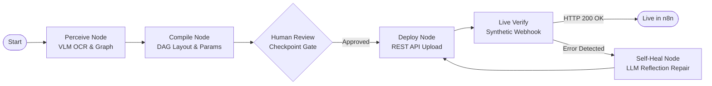

<!-- SLIDE 1: TITLE SLIDE -->

# **SketchFlow**
### Autonomous Sketch-to-n8n Workflow Automation Platform

<span class="badge">GOMYCODE HACKATHON 2026 · NVIDIA × BREV</span>

**Transform hand-drawn whiteboard flowcharts and paper diagrams into live, verified, self-healing n8n automations.**

<br/>

- **Domain:** Multimodal Agentic AI · Business Process Automation
- **AI Stack:** NVIDIA NIM (`moonshotai/kimi-k3` & `nemotron-3-ultra-550b`) · Groq Cloud
- **Frameworks:** LangGraph · FastAPI · React 18 · Excalidraw · Docker n8n

<footer>SketchFlow · Autonomous Workflow Engineering</footer>

---

<!-- SLIDE 2: THE PROBLEM -->

## The Problem: The Analog-to-Digital Chasm

<div class="grid-2">
  <div class="card">
    <h3>Where Workflows Are Born</h3>
    <p>💡 <strong>Whiteboard & Paper Brainstorming</strong></p>
    <ul>
      <li>Fast, natural, collaborative</li>
      <li>Boxes, diamonds, and hand-drawn arrows</li>
      <li>Clear business intent & decision routing</li>
    </ul>
    <p><em>"Takes 2 minutes to sketch on paper."</em></p>
  </div>

  <div class="card">
    <h3>Where Friction Kills Momentum</h3>
    <p>⏳ <strong>Manual Re-Implementation Hell</strong></p>
    <ul>
      <li>Selecting from <strong>400+ n8n integrations</strong></li>
      <li>Manual canvas drag-and-drop & alignment</li>
      <li>Writing <code>={{ $json.body }}</code> expressions</li>
      <li>Debugging REST schemas and parameter types</li>
    </ul>
    <p><em>"Takes 2 to 4 hours of tedious manual rebuilding."</em></p>
  </div>
</div>

<div class="highlight-box">
  <strong>The Missing Link:</strong> An autonomous perception-to-execution engine that reads sketches like a human engineer and compiles them into production-ready software.
</div>

<footer>The Problem · The Workflow Translation Bottleneck</footer>

---

<!-- SLIDE 3: THE SOLUTION -->

## The Solution: Enter SketchFlow

**A full-lifecycle agentic platform that converts sketches directly into running, verified workflows.**

<div class="grid-3">
  <div class="card">
    <h3>1. See & Understand</h3>
    <p><strong>Multimodal Perception</strong></p>
    <p>Reads hand-drawn diagrams, OCR handwriting, shapes, and directed branches from photos or an in-browser vector canvas.</p>
  </div>
  <div class="card">
    <h3>2. Plan & Lay Out</h3>
    <p><strong>Topological Synthesis</strong></p>
    <p>Computes collision-free DAG coordinates and queries official n8n documentation for exact node configurations.</p>
  </div>
  <div class="card">
    <h3>3. Deploy & Verify</h3>
    <p><strong>Closed-Loop Execution</strong></p>
    <p>Deploys to a live n8n instance, tests webhooks live, and auto-repairs errors via self-healing reflection.</p>
  </div>
</div>

<div class="highlight-box">
  🛡️ <strong>Safety Built-In:</strong> Pauses at a mandatory <strong>Human-in-the-Loop</strong> review checkpoint so operators inspect parameters and securely bind credentials.
</div>

<footer>The Solution · SketchFlow System Overview</footer>

---

<!-- SLIDE 4: SYSTEM ARCHITECTURE -->

## System Architecture: Cyclic LangGraph State Machine



- **Cyclic Agent Design:** Built with **LangGraph StateGraph** and persistent **SqliteSaver** checkpointing.
- **Interruption Gate:** Pauses automatically before `deploy` (`interrupt_before=["deploy"]`).
- **Telemetry Streaming:** Real-time **Server-Sent Events (SSE)** push node updates, agent thoughts, and tool latencies to the frontend.

<footer>System Architecture · LangGraph Cyclic Pipeline</footer>

---

<!-- SLIDE 5: MULTIMODAL PERCEPTION & DAG AUTO-LAYOUT -->

## Engineering Innovation: Perception & Spatial Auto-Layout

<div class="grid-2">
  <div class="card">
    <h3>1. Perception to Schema DTO</h3>
    <ul>
      <li>Extracts raw image into a vendor-neutral <code>SketchGraph</code>:
        <ul>
          <li><strong>Nodes:</strong> Roles (<code>trigger</code>, <code>condition</code>, <code>action</code>), shapes, OCR text</li>
          <li><strong>Edges:</strong> Source, target, branch labels (<code>yes</code>, <code>no</code>, <code>error</code>)</li>
        </ul>
      </li>
      <li>Detects handwriting ambiguities for review.</li>
    </ul>
  </div>

  <div class="card">
    <h3>2. Topological Spatial Layout</h3>
    <ul>
      <li>Hand-drawn sketches have no coordinates.</li>
      <li>Assigns topological layers via <strong>Breadth-First Traversal</strong> with cycle detection:
        <br/><code>X = 240 + layer × 300px</code>
      </li>
      <li>Vertically centers parallel branches:
        <br/><code>Y = 300 + (idx - (count-1)/2) × 160px</code>
      </li>
      <li><strong>Result:</strong> Zero overlapping boxes on the n8n canvas.</li>
    </ul>
  </div>
</div>

<div class="highlight-box">
  <strong>Multi-Branch Routing:</strong> Automatically maps conditional IF nodes to n8n multidimensional arrays: <code>main[0]</code> for True/Yes and <code>main[1]</code> for False/No.
</div>

<footer>Perception & Spatial Auto-Layout Algorithms</footer>

---

<!-- SLIDE 6: QUALITY OF AI USE & FOUNDATION MODELS -->

## Quality of AI: NVIDIA NIM & Resilient Fallbacks

<div class="grid-2">
  <div class="card">
    <h3>Primary: NVIDIA NIM Architecture</h3>
    <p><span class="badge">NVIDIA NIM</span> <strong>High-Performance Inference</strong></p>
    <ul>
      <li><strong>Perception (VLM):</strong> <code>moonshotai/kimi-k3</code>
        <br/>Superior handwriting OCR and multi-branch arrow tracing.
      </li>
      <li><strong>Synthesis & Repair (LLM):</strong> <code>nvidia/nemotron-3-ultra-550b-a55b</code>
        <br/>550B MoE agentic reasoning engine for complex parameter synthesis and n8n expressions (<code>={{ $json.body }}</code>).
      </li>
    </ul>
  </div>

  <div class="card">
    <h3>Multi-Tier Fallback Hierarchy</h3>
    <p><strong>Guaranteed Uptime & Zero Crash Policy</strong></p>
    <ol>
      <li><strong>Tier 1:</strong> NVIDIA NIM (Nemotron 550B & Kimi-k3)</li>
      <li><strong>Tier 2:</strong> Groq Cloud (Qwen 3.8 Vision & GPT-OSS 120B)</li>
      <li><strong>Tier 3:</strong> Algorithmic 100+ Node Catalog Match</li>
      <li><strong>Tier 4:</strong> Universal JavaScript Code Node Scaffold</li>
    </ol>
    <p><em>The system never crashes, even without external API keys.</em></p>
  </div>
</div>

<div class="highlight-box">
  📚 <strong>Dynamic Docs Lookup:</strong> Live tool dynamically queries <code>docs.n8n.io</code> via the <code>llms.txt</code> index to fetch authoritative parameter schemas for obscure services.
</div>

<footer>Quality of AI · Model Selection & Fallback Architecture</footer>

---

<!-- SLIDE 7: RESPONSIBLE AI & HUMAN-IN-THE-LOOP -->

## Responsible AI: Human-in-the-Loop Review Gate

<div class="card">
  <h3>Why Full Autonomy Is Dangerous for Enterprise Automations</h3>
  <p>An AI agent should <strong>never</strong> deploy database queries or financial integrations without human sign-off. Nor should it ever handle plaintext secrets.</p>
</div>

<br/>

<div class="grid-3">
  <div class="card">
    <h3>1. Checkpoint Pause</h3>
    <p>The LangGraph agent persists state and pauses before deployment, rendering the <strong>Human Review Modal</strong>.</p>
  </div>
  <div class="card">
    <h3>2. Parameter Inspection</h3>
    <p>Operators inspect AI-inferred table names, routes, and email recipients, with 1-click inline editing.</p>
  </div>
  <div class="card">
    <h3>3. Zero-Secret Vault Binding</h3>
    <p>Instead of plaintext API keys, operators bind n8n credential IDs (e.g. <code>slackApi</code>, <code>postgres</code>). Secrets remain in n8n's vault.</p>
  </div>
</div>

<div class="highlight-box">
  ⚖️ <strong>Pre-Flight Linter:</strong> Automated rule-based engine checks for missing triggers, duplicate names, and orphaned edges before the user approves.
</div>

<footer>Responsible AI · Human Oversight & Safe Credential Vaulting</footer>

---

<!-- SLIDE 8: CLOSED-LOOP VERIFICATION & SELF-HEALING -->

## Verification & Self-Healing: The Closed Loop

<div class="grid-2">
  <div class="card">
    <h3>Live Execution Verification</h3>
    <ul>
      <li>Deploys workflow payload via n8n REST API.</li>
      <li>Activates workflow (REST API + Docker CLI fallback).</li>
      <li>Extracts exposed webhook slug: <code>/webhook/lead-intake</code>.</li>
      <li><strong>Dispatches synthetic HTTP test event</strong> to verify that the workflow triggers and responds with HTTP 200 OK.</li>
    </ul>
    <p><em>Guarantees the automation actually runs in production.</em></p>
  </div>

  <div class="card">
    <h3>Self-Healing Reflection Loop</h3>
    <ul>
      <li>If n8n returns schema errors or webhook 4xx/5xx:
        <ol>
          <li>The agent intercepts the error message.</li>
          <li>Passes context to <code>self_heal_node</code>.</li>
          <li>Prompts Nemotron-3-Ultra-550B with <code>REPAIR_SYSTEM_PROMPT</code>.</li>
          <li>Applies minimal surgical patches.</li>
          <li>Re-deploys automatically (up to 2 retry attempts).</li>
        </ol>
      </li>
    </ul>
  </div>
</div>

<div class="highlight-box">
  🔄 <strong>Autonomous Resilience:</strong> From broken parameter to repaired workflow without human intervention.
</div>

<footer>Closed-Loop Verification & Self-Healing Reflection Engine</footer>

---

<!-- SLIDE 9: THE FRONTEND STUDIO & TELEMETRY HUB -->

## The Developer Experience: Studio UI & Telemetry

<div class="grid-2">
  <div class="card">
    <h3>Dual Ingestion Studio</h3>
    <ul>
      <li><strong>Vector Whiteboard:</strong> Embedded <code>@excalidraw/excalidraw</code> canvas for instant diagramming with shape and text tools.</li>
      <li><strong>Photo Uploader:</strong> Drag-and-drop zone with instant image preview for physical whiteboard and paper photos.</li>
      <li><strong>1-Click Synthesis:</strong> Generates workflows in seconds.</li>
    </ul>
  </div>

  <div class="card">
    <h3>Real-Time Telemetry Console</h3>
    <ul>
      <li><strong>Console Stream:</strong> Color-coded log transitions streamed via Server-Sent Events (SSE).</li>
      <li><strong>Reasoning Trace:</strong> Live chain-of-thought monologue from the agent.</li>
      <li><strong>Tool Calls Inspector:</strong> Expandable cards displaying exact tool inputs, outputs, and latencies in milliseconds.</li>
    </ul>
  </div>
</div>

<div class="highlight-box">
  🚀 <strong>1-Click n8n Launch:</strong> Once deployed, the UI provides a deep-link directly into the active workflow on the n8n canvas editor.
</div>

<footer>User Experience · Excalidraw Studio & Real-Time Telemetry Console</footer>

---

<!-- SLIDE 10: ENGINEERING EXCELLENCE & TESTING -->

## Engineering Excellence & Test Suite

<div class="grid-3">
  <div class="card">
    <h3>Decoupled Architecture</h3>
    <p>Clean layer separation: Pydantic v2 DTOs $\rightarrow$ Core Services $\rightarrow$ LangGraph Agent $\rightarrow$ FastAPI Gateway $\rightarrow$ React SPA.</p>
  </div>
  <div class="card">
    <h3>Modern Tooling</h3>
    <p>Built with <strong>Python 3.11+</strong> and packaged with <strong>uv</strong> for deterministic sub-second environment resolution and lockfile management.</p>
  </div>
  <div class="card">
    <h3>Automated Test Coverage</h3>
    <p><strong>22 / 22 Tests Passing</strong> across schemas, DAG layout algorithms, compiler branch indexing, checkpointing, and SSE streams.</p>
  </div>
</div>

<br/>

```bash
uv run pytest tests -v
# ============================== 22 passed in 6.00s ==============================
# - test_inspect_node_schema_tool            PASSED
# - test_calculate_dag_layout_tool           PASSED
# - test_compiler_service_compilation        PASSED
# - test_agent_graph_pauses_at_human_review  PASSED
# - test_agent_run_and_resume_sse_streaming  PASSED
```

<footer>Engineering Excellence · 100% Passing Unit & Integration Tests</footer>

---

<!-- SLIDE 11: REAL-WORLD IMPACT & USE CASES -->

## Real-World Impact: Automating Across Industries

<div class="grid-2">
  <div class="card">
    <h3>Business Operations & Triage</h3>
    <p><strong>Supply Chain & Lead Management</strong></p>
    <p><em>Sketch:</em> <code>Webhook</code> $\rightarrow$ <code>Check VIP</code> $\rightarrow$ <code>Update Postgres</code> $\rightarrow$ <code>Slack Alert</code></p>
    <p><em>Impact:</em> Non-technical operators sketch SOPs on a whiteboard; SketchFlow deploys the working integration in under 60 seconds.</p>
  </div>

  <div class="card">
    <h3>DevOps & Incident Response</h3>
    <p><strong>Monitoring & Alert Escalation</strong></p>
    <p><em>Sketch:</em> <code>Alert Webhook</code> $\rightarrow$ <code>Severity Check</code> $\rightarrow$ <code>PagerDuty</code> / <code>Jira Ticket</code></p>
    <p><em>Impact:</em> Eliminates hours of manual API wiring during post-mortems or architectural sprint planning.</p>
  </div>
</div>

<div class="highlight-box">
  ⏱️ <strong>Time-to-Value:</strong> Reduces workflow creation time from <strong>~2 hours</strong> of manual configuration to <strong>under 30 seconds</strong>.
</div>

<footer>Real-World Impact · Operations, DevOps, and Enterprise Use Cases</footer>

---

<!-- SLIDE 12: ROADMAP & FUTURE VISION -->

## The Roadmap: What Comes Next

<div class="grid-3">
  <div class="card">
    <h3>Phase 1: Bi-Directional Sync</h3>
    <p>Sync changes made in the n8n visual editor back to the Excalidraw vector canvas, maintaining a single visual source of truth.</p>
  </div>
  <div class="card">
    <h3>Phase 2: MCP Tool Integration</h3>
    <p>Incorporate the <strong>Model Context Protocol (MCP)</strong> to dynamically discover custom n8n community nodes and local enterprise tools.</p>
  </div>
  <div class="card">
    <h3>Phase 3: Multi-Agent Teams</h3>
    <p>Specialized sub-agents for synthetic testing, performance load simulation, and automatic documentation generation.</p>
  </div>
</div>

<div class="highlight-box">
  🎯 <strong>Vision:</strong> Making visual whiteboard sketching the primary, universal programming language for workflow automation.
</div>

<footer>The Roadmap · Vision & Next Milestones</footer>

---

<!-- SLIDE 13: CONCLUSION & Q&A -->

# **Thank You!**
### SketchFlow: The Autonomous Sketch-to-n8n Agent

<span class="badge">NVIDIA NIM · LANGGRAPH · N8N · FASTAPI · REACT</span>

<br/>

<div class="grid-2">
  <div class="card">
    <h3>Project Links</h3>
    <ul>
      <li><strong>Web Studio:</strong> <code>http://localhost:8000</code></li>
      <li><strong>Swagger Docs:</strong> <code>http://localhost:8000/docs</code></li>
      <li><strong>Test Suite:</strong> <code>uv run pytest tests -v</code></li>
      <li><strong>Architecture Graph:</strong> <code>docs/assets/agent_graph.png</code></li>
    </ul>
  </div>

  <div class="card">
    <h3>Submission Highlights</h3>
    <ul>
      <li>✅ 100% Functional Live Prototype with Docker n8n</li>
      <li>✅ NVIDIA NIM MoE Vision & Reasoning Models</li>
      <li>✅ Deterministic DAG Auto-Layout Algorithm</li>
      <li>✅ Safe Human-in-the-Loop Review Checkpoint</li>
      <li>✅ Live Webhook Execution & Self-Healing Reflection</li>
    </ul>
  </div>
</div>

<br/>

**Questions & Live Demo Discussion**

<footer>SketchFlow · GOMYCODE Hackathon 2026</footer>
